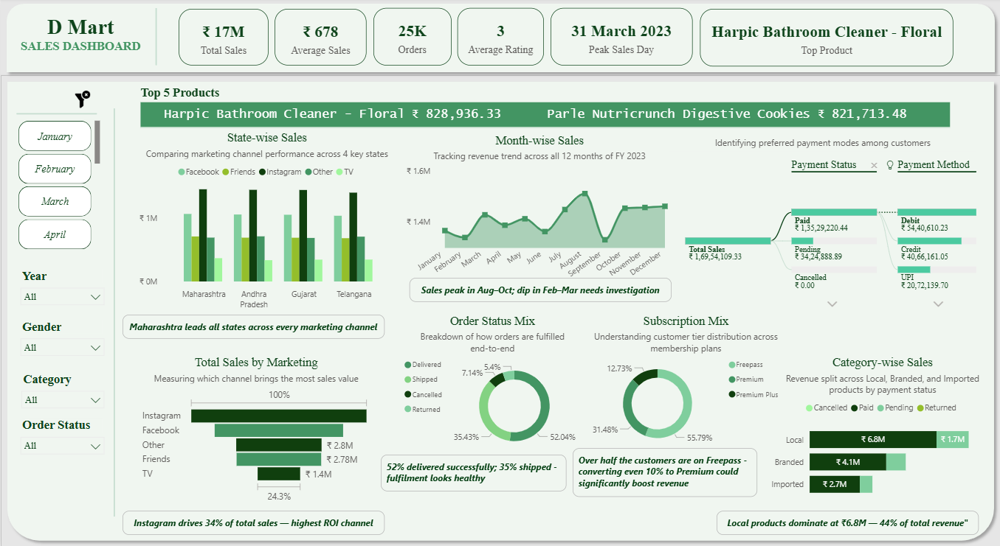
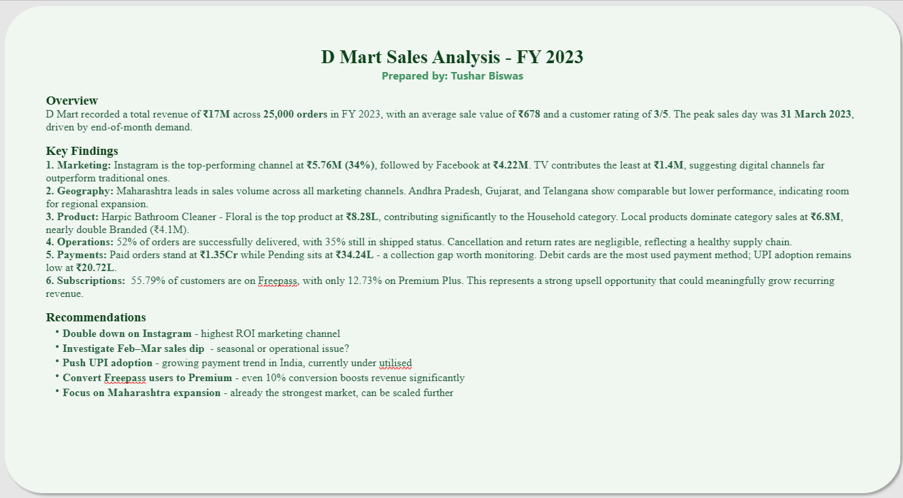

# D Mart Sales Analysis Dashboard - Power BI

## Overview
An interactive sales dashboard built in Power BI analyzing D Mart's FY 2023 sales data.
The report covers revenue trends, marketing performance, product insights, and customer behavior
across 25,000 orders worth ₹17M in total sales.

## Dataset
Synthetic D Mart sales dataset covering FY 2023 with attributes including order status, payment method, marketing channel, product category and customer subscription tier.

## Dashboard and Summary Preview

## Key Insights
- Instagram is the top marketing channel driving ₹5.76M (34%) in sales
- Maharashtra leads all states in revenue across every channel
- Local products dominate at ₹6.8M — 44% of total category revenue
- 55% of customers are on Freepass — strong upsell opportunity to Premium
- Peak sales day was 31 March 2023

## Files
| File | Description |
|------|-------------|
| `Dashboard/` | Screenshots of dashboard and summary page |
| `dmart_sales_dashboard+summary.pbix` | Power BI dashboard file |
| `dmart_sales_analysis_report.pdf` | Visual report with summary |
| `dmart_sales_dataset.xlsx` | Raw dataset used for analysis |

## Tools Used
- Power BI Desktop
